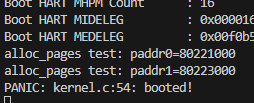
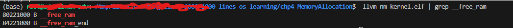

# Chapter 4: Memory Allocation

### Symbols Created: __free_ram and __free_ram_end
- The free memory space is set to 64MB.
- The memory region is aligned to 4KB using ALIGN(4096), ensuring compatibility with page boundaries.
- Instead of hardcoding addresses, the linker determines where the memory block is placed, preventing conflicts with the kernel’s static data.
- On x86-64, operating systems typically determine available memory regions at boot using methods like UEFI's GetMemoryMap.

### Simple Memory Allocation Algortihm
This memory allocation algorithm, known as a Bump Allocator or Linear Allocator, dynamically allocates memory in fixed 4KB page units. It operates as follows:

- The function alloc_pages(n) assigns memory starting from __free_ram and moves the allocation pointer (next_paddr) forward by n * PAGE_SIZE.
- Memory is aligned to 4KB boundaries, ensuring page-aligned addresses.
- next_paddr is retained across calls, behaving like a global variable.
- If allocation exceeds __free_ram_end, a kernel panic occurs.
- memset() fills allocated memory with zeroes to prevent uninitialized memory issues.
- No deallocation mechanism—once memory is allocated, it cannot be freed.

Despite this limitation, bump allocation is efficient and useful for cases where memory is never reclaimed, such as bootloaders or temporary buffer regions. More advanced systems typically implement bitmap-based algorithms or the buddy system for deallocation.
### Example Output

